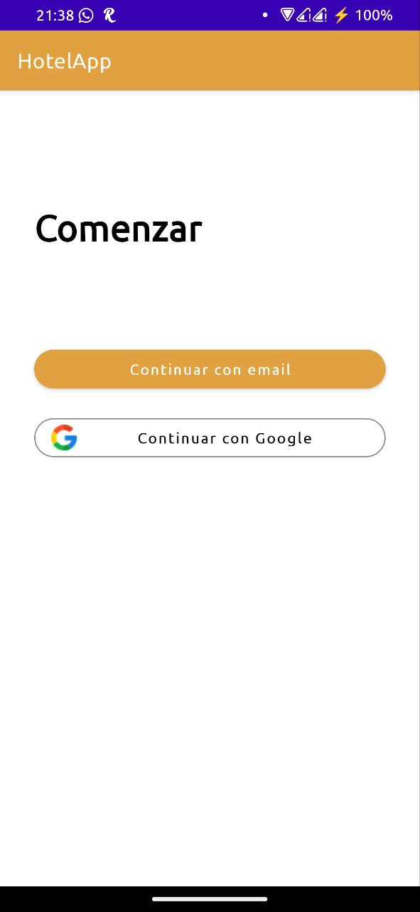
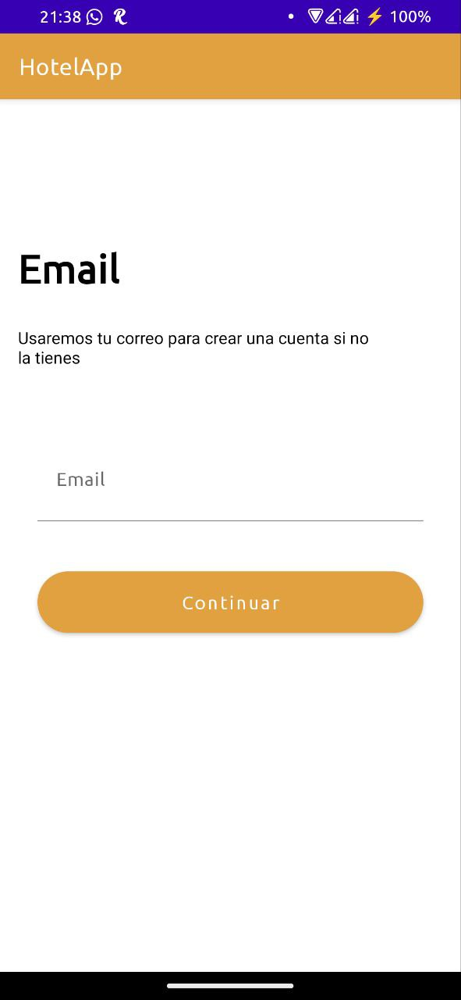
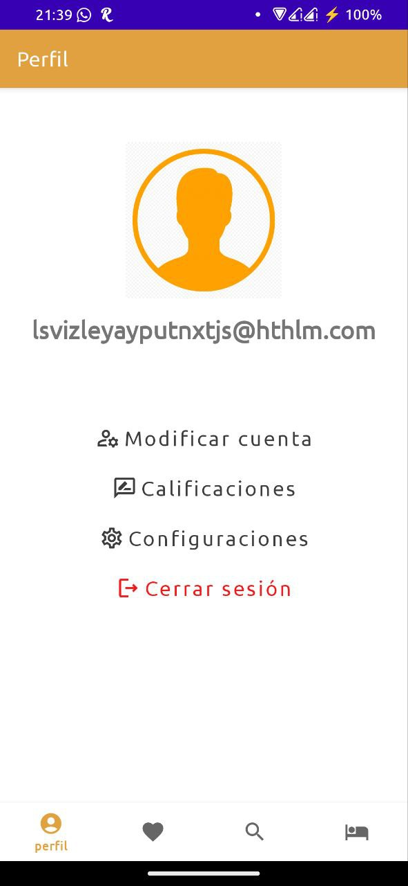
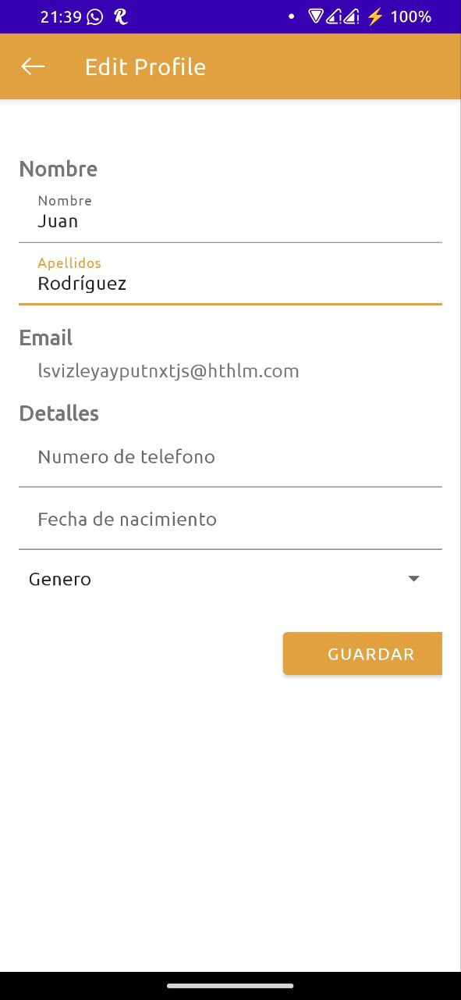
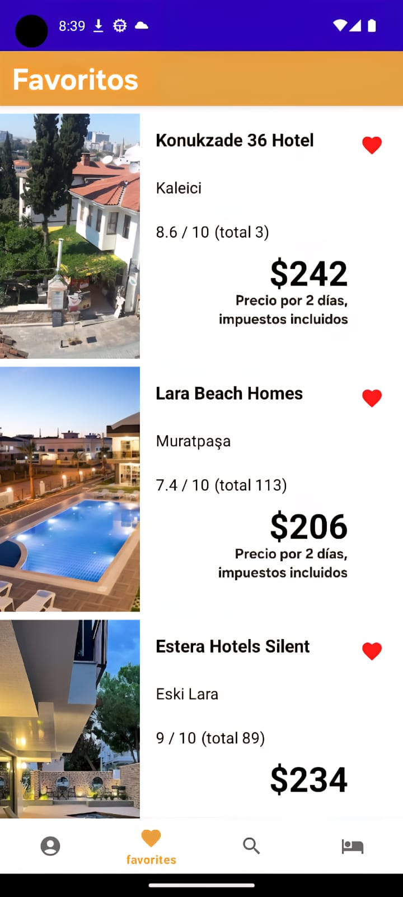
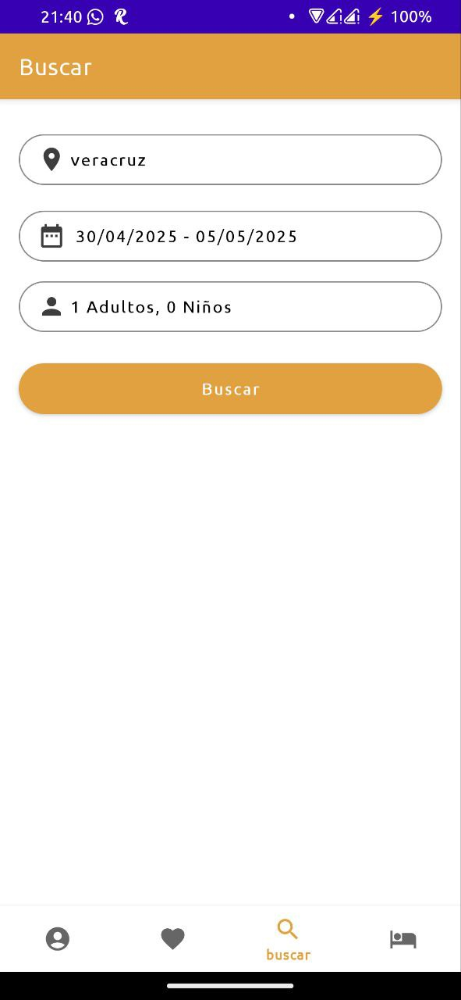
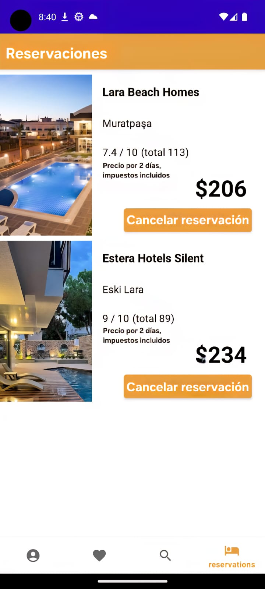
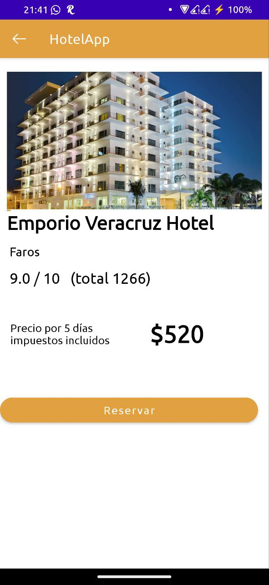

- **Registro y Autenticación de Usuarios**:
  - Los usuarios pueden crear cuentas e iniciar sesión en la app.
  - Se integró la funcionalidad de inicio de sesión con Google para facilitar el acceso usando cuentas de Google.

- **Gestión del Perfil de Usuario**:
  - Los usuarios pueden ver y actualizar la información de su perfil, como nombre y fecha de nacimiento.
  - Las fotos de perfil pueden subirse y almacenarse usando Firebase Storage.

- **Búsqueda de Hoteles**:
  - Los usuarios pueden buscar hoteles según varios criterios como ubicación, fecha y número de huéspedes.
  - Los resultados de búsqueda se muestran con información detallada de cada hotel.
  - Imágenes detalladas del hotel y puntuaciones de reseñas.

- **Filtro por Fecha**:
  - Los usuarios pueden especificar las fechas de check-in y check-out deseadas para filtrar los resultados de búsqueda según disponibilidad.

- **Añadir Hoteles a Favoritos**:
  - Los usuarios pueden añadir hoteles a su lista de favoritos para acceder fácilmente.
  - Los hoteles favoritos se almacenan en la base de datos de Firebase.

- **Especificar Número de Huéspedes**:
  - Los usuarios pueden especificar el número de huéspedes para su reservación.
  - El número de huéspedes se considera durante el proceso de reserva.

- **Realizar Reservas**:
  - Los usuarios pueden hacer reservas en los hoteles seleccionados.
  - Los detalles de la reserva se almacenan en la base de datos de Firebase.

- **Cancelar Reservas**:
  - Los usuarios pueden cancelar sus reservas existentes.
  - Las reservas canceladas se eliminan de la base de datos de Firebase.

## Capturas de Pantalla del Proyecto

|  |  |
|---|---|
| Página de Inicio | Página de Correo Electrónico |

|  |  |
|---|---|
| Página de Perfil | Página de Edición de Perfil |

|  |  |
|---|---|
| Página de Favoritos | Página de Búsqueda |

|  |  |
|---|---|
| Página de Resultados de Búsqueda | Página de Reservas |

|  |  |
|---|---|
| Página Detallada del Hotel |  |

## Tecnologías Utilizadas

- **Firebase Authentication**: Usado para registro de usuarios, inicio de sesión y gestión de perfil.
- **Firebase Realtime Database**: Usado para almacenar datos de hoteles y reservas.

## API

- **API de Hoteles** utilizada en este proyecto. Enlace: [https://rapidapi.com/apidojo/api/hotels4/](https://rapidapi.com/apidojo/api/hotels4/)
